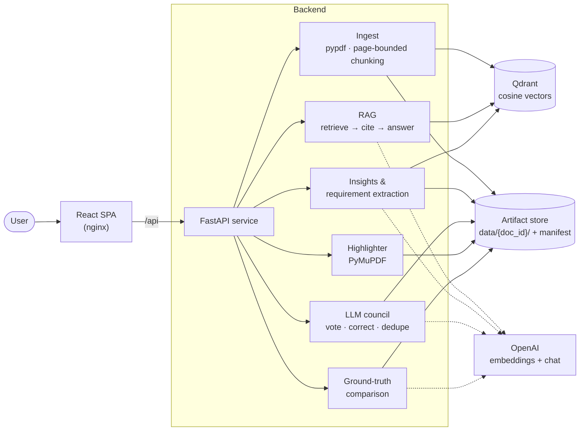
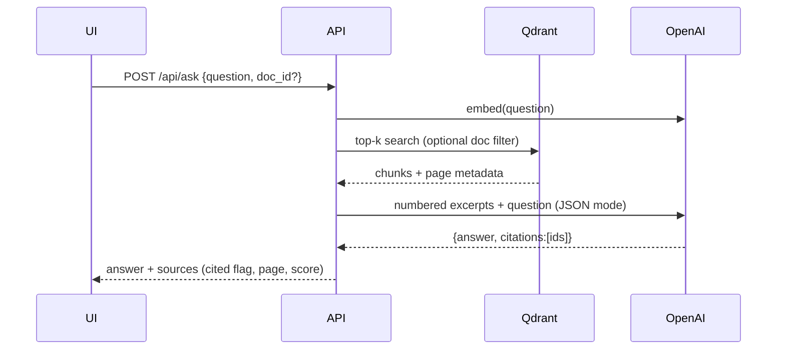
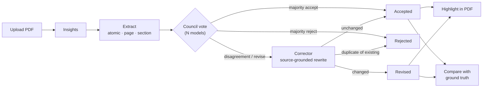

# RAG Document Intelligence

[](https://github.com/siva2517/rag-document-intelligence/actions/workflows/ci.yml)


**Turns contracts, RFPs, and policies into cited answers and an auditable requirements register.**

Reading a 200-page contract to find every obligation is slow, and mistakes are expensive. This platform ingests a PDF and answers questions with page-level citations. It extracts atomic requirements and has a **council of independent LLMs** vote on each one. Flagged items are corrected, every requirement is **highlighted in the original PDF**, and the output is **scored against a business-approved ground truth**. Each stage is persisted and can be reopened, so you can see how every output was produced.

---

## Table of contents

- [Results](#results)
- [Capabilities](#capabilities)
- [Architecture](#architecture)
- [Requirement pipeline](#requirement-pipeline)
- [Key design decisions](#key-design-decisions)
- [Quality engineering](#quality-engineering)
- [Getting started](#getting-started)
- [Configuration](#configuration)
- [API reference](#api-reference)
- [Project structure](#project-structure)
- [Security and data handling](#security-and-data-handling)
- [Limitations and roadmap](#limitations-and-roadmap)

---

## Results

Measured end-to-end against the live OpenAI API on the bundled sample contract (`samples/`). The council used `gpt-4.1-mini` and `gpt-4.1-nano`.

| Stage | Metric | Score |
| --- | --- | --- |
| Requirement extraction + council vs. ground truth (15 items) | Precision / Recall / **F1** | 1.00 / 0.93 / **0.97**, identical across 3 consecutive runs |
| Retrieval (11 labelled questions) | hit@5 / MRR | 1.00 / 0.95 |
| Answers (LLM-as-judge) | Faithfulness / Correctness | 1.00 / 1.00, including a correct "I don't know" on an unanswerable question |
| PDF highlighting | Requirements located in source | 14 / 14 |
| Full pipeline latency | insights → extract → council → highlight | ~16–21 s for a 3-page document |

**How evaluation drove the design.** The first version scored **F1 0.86**, and the evaluation showed three failure modes:

1. Compound sentences ("acknowledge in 15 min *and* resolve in 4 h") stayed merged.
2. The corrector added facts that were not in the source.
3. The council merged split requirements back together.

Each one was fixed with a targeted prompt or code change and a regression test. That raised F1 to **0.97** with precision 1.00.

> Scores come from a deliberately small, fictional contract, so the harness can be reproduced by anyone. Treat them as a regression baseline, not a benchmark. Use the same harness on your own documents (see [Quality engineering](#quality-engineering)).

---

## Capabilities

| Capability | What it does |
| --- | --- |
| **Cited Q&A** | Semantic search over page-bounded chunks. Answers cite numbered excerpts, and the API marks which retrieved sources the model actually used. Refuses when the documents don't contain the answer. |
| **Document insights** | Document type, summary, parties and roles, key dates, obligations, and risks, each with its source page. |
| **Requirement extraction** | Atomic requirements (one obligation each) with stable `REQ-###` IDs, page, clause/section, category, and priority (`must` / `should` / `may`). Deduplicated. |
| **LLM council review** | N models independently vote `accept` / `revise` / `reject` per requirement. A strict majority decides, any disagreement goes to a correction pass, and a post-correction dedupe step runs at the end. Every vote and its reason is recorded. |
| **PDF highlighting** | Annotates each surviving requirement in the original PDF. Matching tolerates the rewording introduced by splitting and correction. |
| **Ground-truth comparison** | Upload a business-approved list (CSV or XLSX). Returns precision, recall, F1, and lists of matched, missed, and extra requirements. |
| **Run persistence and restore** | Each stage writes to a per-document artifact store with a manifest, so the UI restores any previous run, even after a restart. |
| **Evaluation harness** | Measures retrieval (hit@k, MRR) and answer quality (faithfulness, correctness) on a labelled dataset. |

---

## Architecture



| Component | Technology | Responsibility |
| --- | --- | --- |
| Frontend | React 19, Vite, TypeScript, nginx | Upload, Q&A, pipeline controls, council and comparison views. nginx serves the SPA and proxies `/api`. |
| API | FastAPI, Pydantic Settings | Stage orchestration, validation (UUID doc IDs, file types, stage ordering), persistence |
| Vector store | Qdrant | Cosine-similarity search with payload filtering by document |
| LLM provider | OpenAI (`text-embedding-3-small`, `gpt-4.1-*`) | Embeddings, JSON-mode generation, reviewing, judging |
| PDF processing | pypdf (text), PyMuPDF (search + annotation) | Page-accurate extraction and highlighting |
| Artifact store | Local filesystem (Docker volume) | Durable, inspectable output of every stage |

### Q&A request flow



---

## Requirement pipeline



| Stage | Endpoint | Artifact |
| --- | --- | --- |
| Upload | `POST /api/documents` | `original.pdf`, `pages.json` |
| Insights | `POST /api/documents/{id}/insights` | `insights.json` |
| Extraction | `POST /api/documents/{id}/requirements` | `requirements.json` |
| Council review | `POST /api/documents/{id}/review` | `review.json` (status, original text, every vote and its reason) |
| Highlighting | `POST /api/documents/{id}/highlight` | `highlighted.pdf`, `highlight.json` |
| Ground truth | `POST /api/documents/{id}/ground-truth` | `comparison.json` |
| All automatic stages | `POST /api/documents/{id}/pipeline` | all of the above |

Stage order is enforced: the API returns `409` if, for example, a review is requested before extraction. Downstream stages use the council-reviewed set (rejected items removed) when it exists, and otherwise fall back to the raw extraction.

---

## Key design decisions

| Decision | Rationale | Trade-off |
| --- | --- | --- |
| **Chunks never cross page boundaries** | Every citation and requirement maps to exactly one page, which makes auditing possible. | Slightly more, smaller chunks on dense pages. |
| **Numbered excerpts + JSON-mode output** | Shows which sources the model actually cited, rather than everything that was retrieved, and avoids parsing free text. | Depends on the model following the schema. Invalid references are dropped defensively. |
| **Atomic requirements** | One obligation per row matches how business analysts track compliance, and keeps matching and highlighting precise. | The council has to be told explicitly not to re-merge siblings. A dedupe step catches the cases where it still does. |
| **Council of heterogeneous models, strict majority** | Independent reviewers make different mistakes. Disagreement is a useful signal, so it goes to correction rather than being resolved by a coin flip. | N× review cost. Model choice is configurable (`COUNCIL_MODELS`). |
| **Source-grounded corrector** | The corrector sees the source page and the reviewers' reasons, and must not add facts. An unchanged rewrite counts as accepted. | A conservative corrector may leave some awkward wording in place. |
| **Fuzzy highlighting (exact → 6-word windows incl. tail)** | Split and corrected requirements don't match the source verbatim. Including the tail window catches "…and resolved within 4 hours" splits. | Very short generic phrases could over-match. The search is limited to the requirement's own page. |
| **Embedding-based ground-truth matching, greedy one-to-one** | Robust to paraphrase and deterministic: ties go to the earlier ID. One-to-one matching prevents inflated precision. | The threshold (`MATCH_THRESHOLD`, default 0.7) should be calibrated per domain. |
| **LLM behind a `Protocol`** | Tests run against a deterministic fake LLM and in-memory Qdrant, with no network access and no API key, so CI is fast and free. | Prompt quality must be validated separately, which the live evaluation does. |
| **Filesystem artifact store with manifest** | Simple, inspectable, and diff-able. Enables restoring runs and auditing them. | Single-node. Swapping in object storage (S3/Blob) is a contained change. |

---

## Quality engineering

### Automated tests (no API key required)

```bash
cd backend && uv run pytest
```

There are **23 tests** across every layer, and they run in about 1 second in CI:

| Suite | Covers |
| --- | --- |
| `test_ingest.py` | Page-bounded chunking, overlap, word-boundary cuts (regression for a mid-word split bug) |
| `test_council.py` | Majority rules, correction grounding, ignoring invalid votes, unchanged → accepted, post-correction dedupe |
| `test_compare.py` | CSV/XLSX parsing and column detection, one-to-one matching, tie-breaking, empty inputs |
| `test_highlight.py` | Lines that wrap, paraphrased text, split-sentence tails, missing text, out-of-range pages (regression for a PyMuPDF annotation lifetime bug) |
| `test_api.py` | Full pipeline end-to-end, persistence and restore, stage ordering (409), UUID validation, file-download allow-list, delete cascade |
| `test_eval.py` | Evaluation harness metrics, including refusal questions |

### Live evaluation (uses the OpenAI API)

```bash
cd backend
uv run python -m eval.run_eval --pdf ../samples/sample_services_agreement.pdf
```

| Metric | Definition |
| --- | --- |
| `hit@k` | An expected page appears in the top-k retrieved chunks |
| `mrr` | Mean reciprocal rank of the first relevant chunk |
| `faithfulness` | LLM judge: every claim in the answer is supported by the retrieved context |
| `correctness` | LLM judge: the answer agrees with the reference answer |

To evaluate your own corpus, add lines to `eval/dataset.jsonl` (`question`, `expected_pages`, `reference`) and run the eval with your PDFs. For requirement quality, upload your business-approved list on the **Ground truth** tab.

### CI

GitHub Actions runs the backend test suite and the frontend type-check and build on every push and pull request.

---

## Getting started

### Prerequisites

- Docker Desktop, **or** Python 3.11+ with [uv](https://docs.astral.sh/uv/) and Node 22+
- An OpenAI API key

### Run with Docker (recommended)

```bash
git clone https://github.com/siva2517/rag-document-intelligence.git
cd rag-document-intelligence
cp .env.example .env            # set OPENAI_API_KEY
docker compose up --build
```

| Service | URL |
| --- | --- |
| Web UI | http://localhost:8080 |
| API docs (Swagger) | http://localhost:8000/docs |
| Qdrant dashboard | http://localhost:6333/dashboard |

**Five-minute demo**

1. Upload `samples/sample_services_agreement.pdf` (a fictional contract).
2. Click **Run full pipeline**.
3. Look through **Insights** and **Requirements** (hover a council status to see each model's vote), then open the highlighted PDF.
4. On **Ground truth**, upload `samples/sample_ground_truth.csv` to see precision, recall, and F1.
5. Ask something on **Ask**, e.g. *"How fast must a security breach be reported?"*

### Local development

```bash
docker run -p 6333:6333 qdrant/qdrant           # vector DB

cd backend
uv sync
uv run uvicorn app.main:app --reload             # http://localhost:8000

cd ../frontend
npm install
npm run dev                                      # http://localhost:5173 (proxies /api)
```

---

## Configuration

All settings are environment variables (read from `.env`):

| Variable | Default | Purpose |
| --- | --- | --- |
| `OPENAI_API_KEY` | — | Required |
| `CHAT_MODEL` | `gpt-4.1-mini` | Answers, insights, extraction, judging |
| `EMBEDDING_MODEL` / `EMBEDDING_DIM` | `text-embedding-3-small` / `1536` | Must match each other |
| `COUNCIL_MODELS` | `gpt-4.1-mini,gpt-4.1-nano` | Reviewers, comma-separated. The first one is also the corrector. |
| `MATCH_THRESHOLD` | `0.7` | Minimum cosine similarity for a ground-truth match |
| `CHUNK_SIZE` / `CHUNK_OVERLAP` | `1000` / `150` | Characters |
| `TOP_K` | `5` | Chunks retrieved per question |
| `QDRANT_URL` | `http://localhost:6333` | Overridden to the service name in Docker Compose |
| `DATA_DIR` | `data` | Artifact store root (a Docker volume in Compose) |

---

## API reference

Interactive docs are available at `/docs`.

| Method | Path | Description |
| --- | --- | --- |
| `GET` | `/api/health` | Liveness |
| `POST` | `/api/documents` | Upload and index a PDF |
| `GET` | `/api/documents` | List documents |
| `DELETE` | `/api/documents/{id}` | Delete the vectors and all artifacts |
| `POST` | `/api/ask` | `{question, doc_id?}` → answer + sources with `cited` flags |
| `POST` | `/api/documents/{id}/insights` | Document insights |
| `POST` | `/api/documents/{id}/requirements` | Extract requirements |
| `POST` | `/api/documents/{id}/review` | Council review and correction |
| `POST` | `/api/documents/{id}/highlight` | Generate the highlighted PDF |
| `POST` | `/api/documents/{id}/ground-truth` | Compare with a CSV/XLSX ground truth |
| `POST` | `/api/documents/{id}/pipeline` | Insights → extract → review → highlight |
| `GET` | `/api/documents/{id}/state` | All artifacts for a document (restores a run) |
| `GET` | `/api/documents/{id}/files/{name}` | Download `original.pdf` or `highlighted.pdf` |

<details>
<summary>Example: council-reviewed requirement</summary>

```json
{
  "id": "REQ-004",
  "text": "Severity 1 incidents must be resolved or mitigated within 4 hours.",
  "page": 2,
  "section": "5. Incident Response",
  "category": "operational",
  "priority": "must",
  "status": "accepted",
  "original_text": "Severity 1 incidents must be resolved or mitigated within 4 hours.",
  "votes": [
    { "model": "gpt-4.1-mini", "verdict": "accept", "issue": "" },
    { "model": "gpt-4.1-nano", "verdict": "accept", "issue": "" }
  ]
}
```
</details>

---

## Project structure

```
├── backend/
│   ├── app/
│   │   ├── main.py         # FastAPI app factory, endpoints, stage orchestration
│   │   ├── config.py       # Environment-driven settings
│   │   ├── ingest.py       # PDF text extraction, page-bounded chunking
│   │   ├── store.py        # Qdrant wrapper (upsert, search, per-document scroll/delete)
│   │   ├── llm.py          # LLM protocol + OpenAI implementation
│   │   ├── rag.py          # Cited answering, insights, requirement extraction
│   │   ├── council.py      # Multi-model review, correction, dedupe
│   │   ├── highlight.py    # PDF annotation with fuzzy matching
│   │   ├── compare.py      # Ground-truth loading and matching
│   │   └── artifacts.py    # Per-document artifact store + manifest
│   ├── eval/               # Evaluation harness + labelled dataset
│   ├── tests/              # 23 offline tests (fake LLM, in-memory Qdrant)
│   └── Dockerfile
├── frontend/               # React + Vite SPA, nginx config, Dockerfile
├── samples/                # Fictional contract, its ground truth, generator script
├── docker-compose.yml      # qdrant + backend + frontend
└── .github/workflows/ci.yml
```

---

## Security and data handling

- **Secrets** are read only from `.env`, which is git-ignored. `.env.example` holds placeholders only.
- **Input validation:** document IDs are parsed as UUIDs, which blocks path traversal into the artifact store. Downloads are restricted to an allow-list. Uploads are limited to PDF (and CSV/XLSX for ground truth), with a 50 MB cap at nginx.
- **Data flow:** document text is sent to the configured OpenAI models for embedding and generation. For regulated data, use a provider deployment that matches your compliance requirements (e.g. Azure OpenAI with data residency). The `LLM` protocol keeps that swap to a single class.
- **Not production-hardened yet:** there is no authentication, multi-tenancy, or rate limiting (see the roadmap).

---

## Limitations and roadmap

**Current limitations**

- PDF only. Scanned PDFs need OCR first.
- Pipeline stages run synchronously within the request.
- Single-node artifact store, and no authentication.

**Roadmap**

- [ ] DOC/DOCX intake via LibreOffice conversion (keeps page citations and highlighting)
- [ ] OCR for scanned documents
- [ ] Hybrid retrieval (BM25 + vectors) with reranking
- [ ] Background job queue with progress streaming for large documents
- [ ] AuthN/AuthZ and per-tenant collections
- [ ] Object-storage artifact backend (S3 / Azure Blob)
- [ ] Larger public evaluation set (e.g. open government RFPs)

---

## License

[MIT](LICENSE). Note that PyMuPDF is licensed under AGPL-3.0. If you distribute this service commercially, review that license or swap in a differently licensed PDF annotator.
